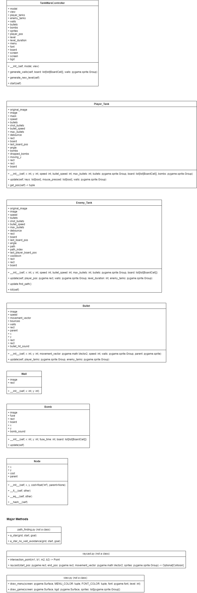

# TankWars
CPSC 4160 2D game project

[Game Preview Video](https://youtu.be/VgOCI6d4O_c)

## Gameplay
Tank Wars is a similar game to the tank game from WiiPlay. The goal is to survive as many levels as possible. Each level is procedurally generated with enemy tanks of increasing difficulty. Each tank can shoot bullets at each other. The player tank can also drop bombs that break walls and kill enemy tanks.

## Versions
- Tested with `python 3.10.11` on `Windows 11` and `MacOS Big Sur 11.4`

## Download
- Clone repo with SSH `git clone git@github.com:jtmarks6/TankWars.git`
- Clone repo with HTTPS `git clone https://github.com/jtmarks6/TankWars.git`

## Setup
- Run `pip install pygame`

## Start Game
- Run `python3 main.py`

## Controls
- `WASD` for movement
- `Mouse` to aim bullets
- `Left mouse click` to shoot bullets
- `Space` to drop a bomb
- `Enter` to start the game

# Game Design

## Mechanics

### Gameplay Loop
- Start a new game
- Kill enemy tanks with bullets or bombs until they are all are dead
- Move on to next level
- Repeat until you die

### Core Mechanics
- Shoot bullets to kill enemy tanks.
- Drop bombs to break walls or kill enemy tanks.
- Walls block bullets and provide shelter.

### Game Gimmick
- Procedurally generated walls make the game levels unique every playthrough. Walls protect the player from view of enemy tanks
- Enemy tank AI that will find a valid path to the player and shoot when there is an open shot. The enemy tank AI lets the player play against people without having multiplayer

### Why is my game different
- To my knowledge there is no procedurally generated tank survival games.
- The games this game was modeled after has static pre defined walls and levels.

### Game engine utilization
- This game uses a game engine following model view controller made for the first 4160 project.
- Using this allowed me to have a standardized structure that took care of the common repetitive code

## Story

### Theme
- Top down military warefare

### Protagonist
- The player tank is the protagonist represented with a blue tank.

### Antagonist
- The enemy tanks are the antagonists represented with red tanks.

## Player Experience

### Emotions
- Fear of dying to enemy tanks
- Stress while dodging enemy bullets
- Accomplished after killing all the tanks in a level

### Challenges
- The player will face increasingly difficuly enemy tanks
- They will do their best to kill all the enemies in a level without dying
- They will utilize their bullets and bombs to defeat all the enemies

### Rewards
- The player will recieve a higher score at the end of the game the farther they progress
- The score is the amount of levels that they have completed

### Feedback
- The player will have immediate feedback of dying if they are shot
- Dying results in having to start a new game

### Audio and Visual
- There are sound effect played when a bullet hits something, a enemy tank dies, and a bomb explodes
- There are not special visual effects other than the animation moving the objects around

# Game Design Changes

## Original Game Design
This game will be an action based tank survival game. It is inspired by the WiiPlay tank game,
but will be top down with much more simple graphics. The goal of the game will be to survive as
many levels as possible. Procedural generation will be used to make incrementally harder levels
the longer the player survives. There will be a few different types of enemy tanks depending on
the level. Some of the types of enemy tanks will be stationary, random movement between
waypoints, and chase the player. The player will be able to drop bombs that explode after a
delay and shoot bullets that travel linearly and bounce once off walls. Enemy tanks will have the
same weapons as the player. There will be randomized walls to navigate. Some of the walls will
be able to be destroyed with a player or enemy bomb. Movement will be from awsd or arrow
keys keyboard input. The bullets will be aimed with mouse position and shot with a left mouse
click. Bombs will be triggered from the spacebar. Enemy tanks will be controlled by a simple AI.
The level will be built using a grid system. The enemy AI will have access to the player position
and wall positions. The enemy AI can use these inputs along with a path finding algorithm to
find the optimal path toward the player. If there is extra time after the MVP, enemy tanks will get
access to which walls are breakable. They will use this info to make new quicker paths toward
the player. Player and enemy tanks will both die after a single hit from a bullet or bomb. The
goal of each wave/level is for the player to kill all the enemy tanks to move on. As the player
survives longer each level will have more enemy tanks as well as enemy tanks with increased
stats. The game gimmicks will be the procedurally generated walls and the enemy tank ai.

## Changes overtime
A big technical change that was not specifically mentioned in the original design was making my own raycasting function. I needed more information than I could get from the built in pygame sprite collision system, so I built my own. This raycast function gives me the exact coordinates that a sprite collided with along a vector even if the end location is past the collided object. This allowed me to teleport the object back to the point that it first collided before rendering the objects. This also made it easy to test if an enemy tank could see a player and should shoot. I also changed the grid that tracked sprite locations to include a pointer to the wall sprites. This helped me to implement the bomb to easily know which sprite to kill based of a cell in the grid.

## Changes in game mechanics
The only change I made to game mechanics is making all walls other than the outisde border breakable. This allowed me to not have to validate if there was a valid path to all tanks as the player could just break through the walls and make a valid path. This made it much simpler to do procedural generation with the walls. I also changed the enemy tanks to be less intelligent than I originally planned. I did not have time to get the enemy tank ai to use bombs or have any strategy other than follow shortest path to player and shoot when they are visible.

## Game gimmick changes
The game gimmicks did not change throughout the development. One of the gimmicks, the enemy tank ai, did end up being less intelligent than originally planned, but still is ai that can properly fight against the player. This is due to not having time to create an in depth intelligent ai.

# Game Documentation

## Classes and Functions

## Explanation
This project was built using model view controller. All of the model classes extend pygames sprite class. For a sprite class you need to override the __init__ function to create your custom sprite by loading the image and getting the rect and any custom fields set up. I also overrode the update function of most of the model classes to perform any logic and code that should be run every frame. This includes moving the sprite and handling any effects it has on other objects. The controller initializes all the model classes and controls the overall game. The controller has the game grid and the collections of all sprites. It passes the needed information to each sprite during it's update call. The controller is responsible for starting new levels when needed and toggling the menu screen. The view draws all the sprites to the screen. Pygame sprites have a draw method built in, so the view just clears the past sprite and calls the sprites draw method to draw the new one. The view also is responsible for drawing the menu screen when it is toggled. Player keyboard input is obtained in controller and then passed to Player_Tank as it is the only class to use it currently. It is recorded in controller in case the enemy tank ai uses it in the future to know where the player is moving to. The Player_Tank class gets the mouse position and buttons pressed during the update function as it is the only class that will need mouse information.

## Bugs
The only currently known bug is if walls happen to surround the player on all sides the player will die from the bomb blowing up because it can't move out of the way. This is extremely rare and has only happened about twice so far.

## Tools
I used VSCode and git with Github for development. I used Photoshop to fix a few of the textures.

# Tasks and Performance

## Division of work
I worked solo on the project, so I did all of the work.

## Timeline

### Milestone 1: March 30
- Implemented rendering and game time - March 27
- Created tank sprite by photoshopping a texture I found online- March 29
- Implemented basic player tank movement to work with wasd and collide with walls- March 29
- Created wall and bullet sprite by editing textures I found online- March 30
- Implemented tank aiming toward mouse and bullets that bounce and move at a consistent speed. - March 30
- Implement procedural generation MVP of walls - March 30
- Update Game Document - March 30

### Milestone 2: April 18
- Create bomb sprite - April 18
- Add debounce to tank bullets and limit to 2 shots at a time - April 11
- Test bullets kill enemy tanks and add enemy tanks procedurally- April 11
- Animate tank and bullet textures to rotate- April 11
- Split monolith code into model view controller - April 11
- Implement bombs - April 18
- Implement enemy tank AI (A* and shoot toward player when visible) - April 12
- Update Game Document - April 18

### Final Game Submission: May 3
- Debug tank collision with walls - April 19
- Implement game menu - April 20
- Implement procedural generation that intelligently connects walls - April 21
- Add increasing difficulty with waves survived - April 21
- Add sound effects and music - April 22
- Test game and fix any new bugs - April 23 - May 3
- Finalize Game Document - May 3

### Final Exam Presentation & Submission: May 4

