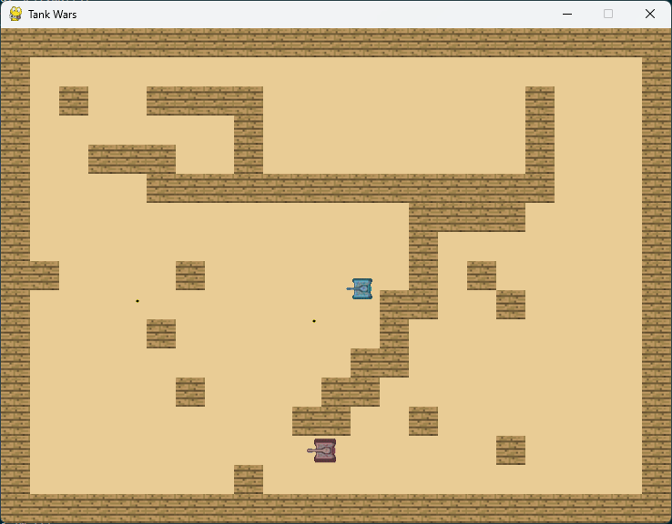
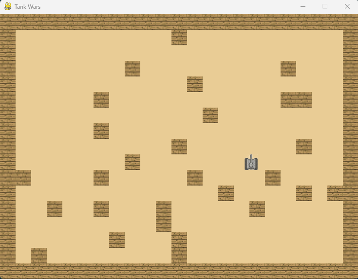

# TankWars
4160 Tank Wars project

## Gameplay
Tank Wars will be a similar game to the tank game from WiiPlay. The goal is to survive as many levels as possible. Each level is procedurally generated with enemy tanks of increasing difficulty. Each tank will be able to shoot bullets at each other as well as drop bombs that will explode after a timer.

# Controls
- `WASD` for movement
- `Left mouse click` to shoot bullets

## Current Progress
- The player tank can move around with wasd keys and will collide with walls
- Left click will shoot a bullet toward the mouse location
- Bullets will bounce once off any walls then be removed from the game
- Walls are randomly placed upon starting the game
- Code is all in main currently because I am learning pygame and keep changing plans so often I didn't want to separate it out until I understand my final archetecture well.

[Video of current progress](https://youtu.be/XLVG5Eh4Rpg)

# Run Game
`python3 main.py`
