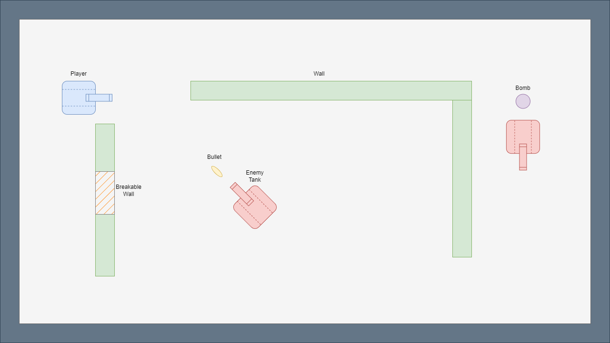

# TankWars
4160 Tank Wars project

## Gameplay
Tank Wars will be a similar game to the tank game from WiiPlay. The goal is to survive as many levels as possible. Each level is procedurally generated with enemy tanks of increasing difficulty. Each tank will be able to shoot bullets at each other as well as drop bombs that will explode after a timer.

# Controls
- `WASD` for movement
- `Mouse` to aim bullets
- `Left mouse click` to shoot bullets
- `Space` to drop a bomb
- `Enter` to start the game

## Setup
- Run `pip install pygame`

# Start Game
- Run `python3 main.py`

[Game Preview Video](https://youtu.be/wgiLZvBLlPg)
